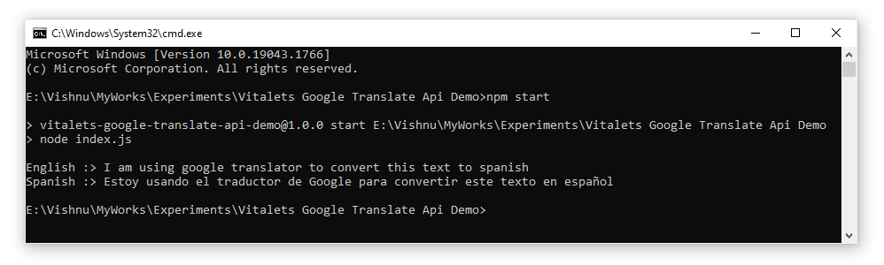

# [@vitalets/google-translate-api](https://www.npmjs.com/package/@vitalets/google-translate-api) demo

### Install
```
npm install
```
or

```
npm install @vitalets/google-translate-api
```

### Usage
From automatic language detection to English:

```
const translate = require('@vitalets/google-translate-api');

translate('Ik spreek Engels', {to: 'en'}).then(res => {
    console.log(res.text);
    //=> I speak English
    console.log(res.from.language.iso);
    //=> nl
}).catch(err => {
    console.error(err);
});
```

### Output
